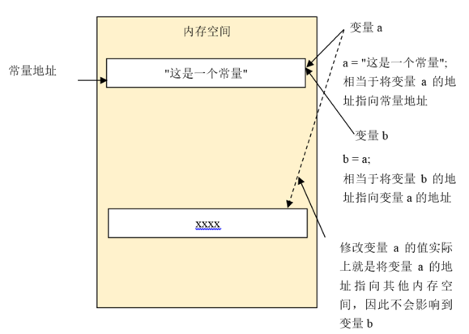
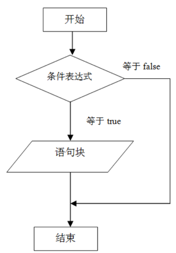
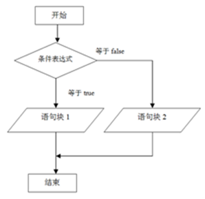
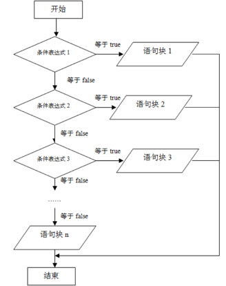
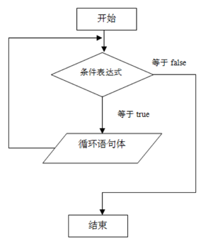
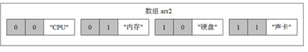
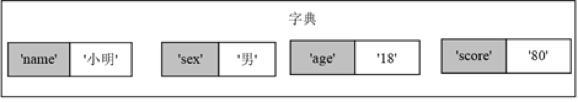

      # SYSU Python Big-data Tutorial #
                  Section 2 
         Copyright by PassionPenguin
            All Rights Reservered

         Last Updated: Jan 30, 2021

# 2 Python 程序设计教程

## 2.1 常量与变量

### 2.1.1 常量

* 变量是内存中命名的存储位置，与常量不同的是变量的值可以动态变化。Python 的标识符命名规则如下：
* 标识符名字的第1个字符必须是字母或下划线（_）；
* 标识符名字的第1个字符后面可以由字母、下划线（_）或数字（0~9）组成；
* 标识符名字是区分大小写的。也就是说 `Score` 和 `score` 是不同的。

```python
a = "这是一个常量"
b = 2
c = True
```

变量值传递的例子：

```python
a = "这是一个变量"
b = a
print(b)  # 此时变量 b 的值应等于变量 a 的值
print("\n")
a = "这是另一个变量"
print(b)  # 对变量 $a 的操作将不会影响到变量 b
```

变量赋值的过程：



可以使用 `id()` 函数输出变量的地址，语法如下：

```python
id('此处修改为变量')
```

例如：

```python
str1 = "这是一个变量"
print("变量str1的值是：" + str1)
print("变量str1的地址是：%d" % (id(str1)))
str2 = str1
print("变量str2的值是：" + str2)
print("变量str2的地址是：%d" % (id(str2)))
str1 = "这是另一个变量"
print("变量str1的值是：" + str1)
print("变量str1的地址是：%d" % (id(str1)))
print("变量str2的值是：" + str2)
print("变量str2的地址是：%d" % (id(str2)))
```

将会看到的是，修改变量内容后其他曾经赋值为这个变量的变量的地址仍然保持不变。

### 2.1.3 类型转换

#### 2.1.3.1 => 数字

1. 使用 `int()` 函数将字符串转换为整数，语法为 `int(x [,base ])`，
    * 其中参数 `x` 是待转换的字符串，参数 `base` 为可选参数，指定转换后整数的进制，默认为 10 进制。

2. 使用 `long()` 函数将字符串转换为长整数，语法为 `long(x [,base ])`，参数的含义与 `int()` 函数相同。

3. 使用 `float()` 函数将字符串或数字转换为浮点数，语法为：`float(x)`，
    * 其中参数 `x` 是待转换的字符串或数字。

4. 使用 `eval()` 函数计算字符串中的有效 Python 表达式，并返回结果，
    * 语法为 `eval(str)`，其中参数 `str` 是待计算的 Python 表达式字符串。
    * 编者注：注意 `eval` 返回的计算值不一定为数字

```python
a = "1"
b = int(a) + 1
print(b)
```

```python
a = "1 + 2"
print(eval(a))
```

#### 2.1.3.2 => 字符

1. 使用str ()函数将数值转换为字符串，语法如下： str (x)
   参数x是待转换的数值。
2. 使用repr ()函数将对象转换为可打印字符串，语法如下： repr(obj)
   参数obj是待转换的对象。
3. 使用chr ()函数将一个整数转换为可对应ASCII的字符，语法如下： chr(整数)
4. 使用ord()函数将一个字符转换为对应的ASCII，语法如下： ord(字符)

```python
print(chr(65))
print(ord('A'))
```

5. 使用hex()函数将一个整数转换为一个十六进制字符串，语法如下： chr(整数)
6. 使用oct()函数将一个整数转换为一个八进制字符串，语法如下： oct(字符)
   使用hex()函数和oct()函数打印8的十六进制字符串和八进制字符串。

```python
print(hex(8))
print(oct(8))
```

十六进制字符串以0x开头，八进制字符串以0o开头。

## 2.2 运算符和表达式

运算符是程序设计语言的最基本元素，它是构成表达式的基础。本节将介绍Python语言运算符和表达式。

### 2.2.1 运算符

Python支持算术运算符、赋值运算符、位运算符、比较运算符、逻辑运算符、字符串运算符、成员运算符和身份运算符等基本运算符。

<!-- TODO: build a table -->

#### 2.2.1.1 算数运算符：

| 算数运算符 | 具体描述 | 例 子 |
| -------- | -------- | ------ |
| + | 相加运算 | 1+2的结果是3 |
| - | 相减运算 | 100-1的结果是99 |
| * | 乘法运算 | 2*2的结果是4|
| \/ | 除法运算 | 4/2的结果是2 |
| % | 求模运算 | 10 % 3的结果是1 |
| ** | 幂运算 | 2**3的结果是8 |
| // | 整除运算 | 9//2的结果 4 |

#### 2.2.1.2 赋值运算符：

| 赋值运算符 | 具体描述 | 例 子 |
| -------- | -------- | ------ |
| = | 直接赋值 | x = 3;将3赋值到变量x中 |
| += | 加法赋值 | x += 3;等同于x = x+3; |
| -= | 减法赋值 | x -=3;等同于x = x-3; |
| *= | 乘法赋值 | x *=3;等同于x = x*3; |
| /= | 除法赋值 | x /=3;等同于x = x/3; |
| %= | 取模赋值 | x =3;等同于x = x%3; |
| **= | 幂赋值 | x **=3;等同于x = x**3; |
| //= | 整除赋值 | x //=3;等同于x = x//3; |

```python
x = 3
x += 3
print(x)
x -= 3
print(x)
x *= 3
print(x)
x /= 3
print(x)
```

#### 2.2.1.3 位运算：

| 位运算符 | 具体描述 |
| ------- | ------- |
| & | 按位与运算，运算符查看两个表达式的二进制表示法的值，并执行按位“与”操作。只要两个表达式的某位都为 1，则结果的该位为 1；否则，结果的该位为 0 |
| &#124; | 按位或运算，运算符查看两个表达式的二进制表示法的值，并执行按位“或”操作。只要两个表达式的某位有一个为 1，则结果的该位为 1；否则，结果的该位为 0 |
| ^ | 按位异或运算。异或的运算法则为：0异或0=0，1异或0=1，0异或1=1，1异或1=0 |
| ~ | 按位非运算。0取非运算的结果为1；1取非运算的结果为0 |
| \<\< | 位左移运算，即所有位向左移 |
| \>\> | 位右移运算，即所有位向右移 |

#### 2.2.1.4 比较运算：

| 比较运算符 | 具体描述 |
| --------- | -------- |
| == | 等于运算符（两个=）。例如a==b，如果a等于b，则返回True；否则返回False |
| != | 不等运算符。例如a!=b，如果a不等于b，则返回True；否则返回False |
| <> | 不等运算符，与!=相同 |
| \< | 小于运算符 |
| \> | 大于运算符 |
| \<= | 小于等于运算符 |
| \>= | 大于等于运算符 |

#### 2.2.1.5 逻辑运算：

| 逻辑运算符 | 具体描述 |
| --------- | -------- |
| and | 逻辑与运算符。例如a and b，当a和b都为True时等于True；否则等于False |
| or | 逻辑或运算符。例如a or b，当a和b至少有一个为True时等于True；否则等于False |
| not | 逻辑非运算符。例如not a，当a等于True时，表达式等于False；否则等于True |

```python
x = True
y = False
print("x and y = ", x and y)
print("x or y = ", x or y)
print("not x = ", not x)
print("not y = ", not y)
```

| 字符串运算符 | 具体描述 |
| ---------- | ------- |
| + | 字符串连接 |
| * | 重复输出字符串 |
| [] | 获取字符串中指定索引位置的字符，索引从0开始 |
| [start: end] | 截取字符串中的一部分，从索引位置start开始到 end结束 in 成员运算符，如果字符串中包含给定的字符则返回 True not in 成员运算符，如果字符串中包含给定的字符返回 True |
| r或者R | 指定原始字符串。原始字符串是指所有的字符串都是直接按照字面的意思来使用，没有转义字符、特殊字符或不能打印的字符。 原始字符串字符串的第一个引号前加上字母"r"或"R" |

```python
b = "hello "
a = b + "world!"
print(a)
print(a * 2)
print(r"hello\nworld!")
```

运算符优先级：

| 运算符 |  具体描述 |
| ----- | -------- |
| ** | 指数运算的优先级最高 |
| ~ + - | 逻辑非运算符和正数/负数运算符。注意，这里的+和-不是加减运算符 |
| * / % // | 乘、除、取模和取整除 |
| + - | 加和减 |
| > > << | 位右移运算和位左移运算
| & | 按位与运算
| ^ | | 按位异或运算和按位或运算 |
| > == != | 大于、等于和不等于 |
| %= /= //= -= += *= **= | 赋值运算符 |
| is 与 is not | 身份运算符 |
| in 与 not in | 成员运算符 |
| not or and | 逻辑运算符 |

```python
a = 1
b = 2
c = 3
a = b + c
a = b - c
a = b * c
a = b / c
a = b % c
a += 1
b = a ** 2
```

## 2.3 常用语句

### 2.3.1 赋值 Assignment

赋值语句是Python语言中最简单、最常用的语句。通过赋值语句可以定义变量并为其赋初始值。在2.2.1小节介绍赋值运算符时，已经涉及到了赋值语句，例如：

```python
a = 2
b = a + 5
```

### 2.3.2 条件 if-else

#### 2.3.2.1 if 语句



```python
a = 2
if a > 10:
    print("变量a大于10")
```

如果语句块中包含多条语句，则这些语句必须拥有相同的缩进。例如：

```python
a = 2
if a > 10:
    print("变量a大于10")
a = 10
```

嵌套条件语句：

```python
a = 2
if a > 10:
    print("变量a大于10")
    if a > 100:
        print("变量\$a大于100")
```

#### 2.3.2.2 else 语句





```python
import datetime

_str = "今天是"

d = datetime.datetime.now()
print(d.weekday())
if d.weekday() == 0:
    _str += "星期一"
elif d.weekday() == 1:
    _str += "星期二"
elif d.weekday() == 2:
    _str += "星期三"
elif d.weekday() == 3:
    _str += "星期四"
elif d.weekday() == 4:
    _str += "星期五"
elif d.weekday() == 5:
    _str += "星期六"
else:
    _str += "星期日"

print(_str) 
```

### 2.3.3 循环 loop

#### 2.3.3.1 while-loop



```python
i = 1
_sum = 0
while i < 11:
    _sum += i
    i += 1
print(_sum)
```

#### 2.3.3.2 for-loop

```
for i in range(0, 1):
   # 循环体
```

```python
i = 1
_sum = 0
for i in range(1, 11):
    print(i)
    _sum += i

print(_sum)
```

如果只计算1~100之间偶数之和：

```python
i = 1;
_sum = 0
for i in range(1, 101):
    if i % 2 == 1:
        continue
    _sum += i

print(_sum)
```

修改为使用break语句跳出循环体。

```python
i = 1
_sum = 0
while True:
    if i == 11:
        break
    _sum += i
    i += 1
print(_sum)
```

### 2.3.4 尝试 try-except

```
try:
    <try语句块>
except [异常处理类, 异常处理类,….] as 异常处理对象:
    异常处理代码
finally:
    最后执行的代码
```

```python
i = 10
print(30 / (i - 10))
```

程序中存在一个30/0的错误，运行该程序会出现下面的报错信息。

```bash
Traceback (most recent call last):
  File "<input>", line 2, in <module>
    print(30 / (i - 10))
ZeroDivisionError: division by zero
```

那么我们可以：

```python
i = 10
try:
    print(30 / (i - 10))
except Exception as e:
    print(e)
finally:
    print("执行完成")
```

## 2.4 序列结构

参考本人译文（xitu/gold-miner#7848）：[Python 中的列表和元组 - 掘金](https://juejin.cn/post/6923195053754023949/)

### 2.4.1 列表

列表（List）是一组有序存储的数据。例如，饭店点餐的菜单就是一种列表。列表具有如下特性：  和变量一样，每个列表都有一个唯一标识它的名称。  一个列表的元素应具有相同的数据类型。 
每个列表元素都有索引和值两个属性，索引是一个从0开始的整数，用于标识元素在列表中的位置；值当然就是元素对应的值。

需要定义一个列表？简简单单地通过这个实例：

```python
menulist = ['红烧肉', '熘肝尖', '西红柿炒鸡蛋', '油焖大虾']
```

如果我们需要打印一个列表，使用 `print()` 即可！

```python
menulist = ['红烧肉', '熘肝尖', '西红柿炒鸡蛋', '油焖大虾']
print(menulist)
```

不知道列表有多长？使用`Len()`即可。而要访问列表的元素，我们可以简单使用 [index] 获取对应的元素，例如：

```python
menulist = ['红烧肉', '熘肝尖', '西红柿炒鸡蛋', '油焖大虾']
print(menulist[0])
print(menulist[3])
```

我们可以通过使用 `.append(newValue)` 添加元素，例如：

```python
menulist = ['红烧肉', '熘肝尖', '西红柿炒鸡蛋', '油焖大虾']
menulist.append('北京烤鸭')
print(menulist)
```

我们也可以使用 `.insert(position, newValue)` 函数，这个函数可以将元素添加到任何位置，例如添加列表美食：

```python
menulist = ['红烧肉', '熘肝尖', '西红柿炒鸡蛋', '油焖大虾']
menulist.insert(4, '北京烤鸭')
print(menulist)
```

或者：`.extend(anotherList)`，如：

```python
menulist1 = ['红烧肉', '熘肝尖']
menulist2 = ['西红柿炒鸡蛋', '油焖大虾']
menulist1.extend(menulist2)
print(menulist1)
```

合并列表：

可以使用 `+` 将2个列表合并，得到一个新的列表，例如合并2个列表：

```python
menulist1 = ['红烧肉', '熘肝尖', '西红柿炒鸡蛋']
menulist2 = ['北京烤鸭', '西红柿炒鸡蛋', '油焖大虾']
menulist3 = menulist1 + menulist2
print(menulist3)
```

要删除列表元素？ `.delete()` 能帮上你忙！ 例如：

```python
menulist = ['红烧肉', '熘肝尖', '西红柿炒鸡蛋']
del menulist[0]
print(menulist)
```

我们还可以使用 `index()` 函数获取列表中某个元素的索引，函数返回元素值在列表中某个元素的索引，如果不存在，则会抛异常，例如：

```python
menulist = ['红烧肉', '熘肝尖', '西红柿炒鸡蛋']
print(menulist.index('红烧肉'))
print(menulist.index('西红柿炒鸡蛋'))
```

遍历列表就是一个一个地访问列表元素，这是使用列表时的常用操作。 可以使用 `for` 语句和 `range()` 函数遍历列表索引，然后通过索引依次访问每个列表元素，方法如下：

```python

list = ['王二', '张三', '李四', '王五']
for i in range(len(list)):
    print(list[i])
```

也可以用 `enumerate(list)` 的方法，访问元素值：

```python
list = ['王二', '张三', '李四', '王五']
for index, value in enumerate(list):
    print("第%d个元素值是【%s】" % (index, value))
```

列表排序操作值按列表元素值的升序、降序或反序重新排列列表元素的位置。

可以使用sort()函数对列表进行升序排列，如：

```python
list = ['apple', 'banana', 'pear', 'grape'];
list.sort()
print(list)
```

列表的倒序：

可以使用 `reverse()` 函数对列表进行反序排列，例如：

```python
list = ['apple', 'Banana', 'pear', 'grape'];
list.reverse()
print(list)
```

使用 `range()` 函数可以产生一个数值递增列表，它的基本语法结构如下：`range(start, end)`
参数说明如下。

1. `start`：一个整数，指定产生的列表的起始元素值。`start` 为可选参数，默认值为 0。
2. `end`：一个整数，指定产生的列表的结束元素值。

`range()` 函数返回一个列表，该列表由从 `start` 开始至 `end` 结束的整数组成。

```python
list1 = range(10)
list2 = range(11, 20)
```

我们还可以嵌套列表，构建多维列表，例如定义二维列表：

```python
list2 = [["CPU", "内存"], ["硬盘", "声卡"]]
```



```python
list2 = [["CPU", "内存"], ["硬盘", "声卡"]]
for i in range(len(list2)):
    print(list2[i])
```

或者：

```python
list2 = [["CPU", "内存"], ["硬盘", "声卡"]]
for i in range(len(list2)):
    list1 = list2[i]
    for j in range(len(list1)):
        print(list1[j])
```

元组与列表非常相似，它具有如下特性：  一经定义，元组的内容不能改变。  元组元素可以存储不同类型的数据，可以是字符串、数字，甚至是元组。  元组元素由圆括号括起来，例如：`t = (1, 2, 3, 4)`

与列表一样，可以使用索引访问元组元素，例如：

```python
t = (1, 2, 3, 4)
print(t[0])
print(t[3])
```

元组长度指元组中元素的数量。可以通过 `len()` 函数获取元组的长度，如：

```python
t = (1, 2, 3, 4)
print(len(t))
```

`for` 语句和 `range()` 函数遍历列表。

```python
list = ['王二', '张三', '李四', '王五']
List = ('1001', 'zhang', 'Math')
for index, value in enumerate(list):
    print("第%d个元素值是【%s】" % (index, value))
```

因为元组的内容不能改变，所以元组没有 `sort()` 函数。可以将元组转换为列表，然后再对列表排序，最后将排序后的列表赋值给元组：

```python
t = ('apple', 'banana', 'pear', 'grape');
l = list(t);
l.sort();
t = tuple(l);
print(t)
```

元组进行反序排列需要转化为列表后再转化为元组

```python
t = ('apple', 'banana', 'pear', 'grape')
l = list(t)
l.reverse()
t = tuple(l)
print(t)
```



字典元素使用 `{}` 括起来，例如，下面的语句可以定义一个空字典。

```python
d1 = {}
```

也可以在定义字典时指定里面的元素，每个元素由键和值组成，键和值之间由冒号（`:`）分割，元素间由逗号（`,`）分割。例如：

```python
d2 = {'name': '小明', 'sex': '男', 'age': '18', 'score': '80'}
```

可以直接使用 `print()` 函数打印字典，如：

```python
d = {'name': '小明', 'sex': '男', 'age': '18', 'score': '80'}
print(d)
```

打印字典的长度：

```python
d = {'name': '小明', 'sex': '男', 'age': '18', 'score': '80'}
print(len(d))
```

字典由字典元素组成。对字典的管理就是对字典元素的访问和操作。可以通过下面的方法获取字典元素的值：

```python
d = {'name': '小明', 'sex': '男', 'age': '18', 'score': '80'}
print(d['name'])
print(d['sex'])
print(d['age'])
print(d['score'])
```

可以通过赋值在字典中添加元素，如果字典中不存在指定键，则添加；否则修改键值：

```python
d = {'name': '小明', 'sex': '男', 'age': '18'}
d['score'] = '80'
print(d)
```

可以使用 `update()` 函数将 2 个字典合并，具体方法如下：

```python
d1 = {'name': '小明', 'sex': '男'}
d2 = {'age': '18', 'score': '80'}
d1.update(d2)
print(d1)
```

使用 `pop()` 方法可以删除指定的字典元素，并返回删除的元素值。具体方法如下：

```python
d = {'age': '18', 'name': '小明', 'score': '80', 'sex': '男'}
d.pop('score')
print(d)
```

可以使用 `in` 关键字判断字典中是否存在指定键的元素，如果字典中存在指定键的元素，则表达式返回 `True`；否则返回 `False`：

```python
d = {'age': '18', 'name': '小明', 'score': '80', 'sex': '男'}
if 'name1' in d:
    print(d['name1'])
else:
    print('不包含键位name1的元素')
```

可以使用 `for.. in` 语句遍历字典的键和值，方法如下：

```python
d = {'age': '18', 'name': '小明', 'score': '80', 'sex': '男'}
for key in d.keys():  # 遍历字典的键
    print('键' + key + '的值：' + d[key]);
```

```python
d = {'age': '18', 'name': '小明', 'score': '80', 'sex': '男'}
for value in d.values():  # 遍历字典的值
    print(value);
```

使用 `clear()` 方法可以清空指定的字典所有元素。具体方法如下：

````python
d = {'age': '18', 'name': '小明', 'score': '80', 'sex': '男'}
d.clear()
print(d)
````

字典里面还可以嵌套字典，例如

```python
{'name': {'first': 'Johney', 'last': 'Lee'}, 'age': 40}
```

可以通过下面的方式访问嵌套字典。

```python
d = {'name': {'first': 'Johney', 'last': 'Lee'}, 'age': 40}
print(d['name']['first'])
```

集合由一组无序排列的元素组成，可以分为可变集合（`set`）和不可变集合（`frozenset`）。可变集合创建后可以添加元素，修改元素和删除元素。而不可变集合创建后则不能改变。

创建可变集合的例子。

```python
s = set('python')
print(type(s))
print(s)
```

创建不可变集合的例子。

```python
fs = frozenset('python')
print(type(fs))
print(fs)
```

打印集合的长度。

```python
s = set('python')
print(len(s))
```

遍历集合元素的例子。

```python
s = set('python')
s = set('python')
for e in s:
    print(e)
```

可以通过调用 `add()` 方法在集合中添加元素，需要注意的是，我们只能在可变集合中添加元素，不能在不可变集合中添加元素。

```python
s = set('python')
s.add('0')
print(s)
```

添加多个集合元素的例子。

```python
s = set([1, 2, 3])
s.update([4, 5, 6])
print(s)
```

可以使用 `remove()` 方法删除指定的集合元素。我们还可以使用 `clear()` 方法可以清空指定的集合所有元素。

```python
s = set([1, 2, 3])
s.remove(1)
print(s)
s.clear()
print(s)
```

可以使用 `in` 判断集合中是否存在指定键的元素，如果集合中存在指定值的元素，则表达式返回 `True`；否则返回 `False`。 判断集合是否存在元素的例子：

```python
s = set([1, 2, 3])
if 2 in s:
    print('存在'])
    else:
    print('不存在')
```

可以使用 `for in` 语句遍历集合的值，

```python
s = set([1, 2, 3])
for e in s:  # 遍历集合 
    print(e)
```

| 操作符 | 实例 | 具体描述 |
| ------ | ---- | ------- |
| == | A==B | 如果A等于B，则返回True；否则返回False |
| != | A!=B | 如果A不等于B，则返回True；否则返回False |
| < | A<B | 如果A是B的真子集，则返回True；否则返回False |
| <= | A<=B | 如果A是B的子集，则返回True；否则返回False |
| > | A>B | 如果A是B的真超集，则返回True；否则返回False |
| > = | A>=B | 如果A是B的超集，则返回True；否则返回False |

```python
s1 = set([1, 2])
s2 = set([1, 2, 3])
if s1 != s2:
    if s1 < s2:
    print('s1是s2的真子集')
if s2 > s1:
    print('s2是s1的超集')
```

可以使用 `|` 操作符计算两个集合的并集，使用|操作符计算两个集合的并集：

```python
s1 = set([1, 2])
s2 = set([3, 4])
s = s1 | s2
print(s)
```

使用 union() 方法计算两个集合的并集。

```python
s1 = set([1, 2])
s2 = set([3, 4])
s = s1.union(s2)
print(s)
```

集合的交集由所有既属于集合 A 又属于集合B的元素组成。 可以使用&操作符计算两个集合的交集。例如：

```python
s1 = set([1, 2, 3])
s2 = set([3, 4])
s = s1 & s2
print(s)
```

使用 `intersection()` 方法计算两个集合的交集：

```python
s1 = set([1, 2, 3])
s2 = set([3, 4])
s = s1.intersection(s2)
print(s)
```

集合的差集由所有属于集合A但不属于集合B的元素组成。 可以使用-操作符计算两个集合的差集，如：

```python
s1 = set([1, 2, 3])
s2 = set([3, 4])
s = s1 - s2
print(s)
```

使用 `difference()` 方法计算两个集合的差集。

```python
s1 = set([1, 2, 3])
s2 = set([3, 4])
s = s1.difference(s2)
print(s)
```